# COMP1110 Assignment 2

## Academic Honesty and Integrity

Honesty and integrity are of utmost importance. These goals are *not* at odds with being resourceful and working collaboratively. You should be resourceful, you should collaborate within your team, and you should discuss the assignment and other aspects of the course with others taking the class. However, *you must never misrepresent the work of others as your own*. You must clearly identify any ideas or code you have taken from elsewhere. At each stage of the assignment, you will be asked to submit a statement of originality, either as a group or as individuals. In this statement, you will declare which ideas or code contained in your submission were sourced from elsewhere.

Please read the ANU's [official position](http://academichonesty.anu.edu.au/) on academic honesty. If you have any questions, please ask me.

Carefully review the [statement of originality](originality.md), which you must complete.  Edit that statement and update it for each stage of the assignment, ensuring that a truthful statement is committed and pushed to your repo when you complete each stage.

## Purpose

In this assignment, you will work as a group to master a number of major themes of this course,
including software design and implementation,
using development tools such as Git and IntelliJ, and using JavaFX to build a user interface.
As an extension task, you may also explore strategies for writing agents that play games.
Above all, this assignment will emphasize group work;
while you will receive an individual mark for your work based on your contributions to the assignment,
you can only succeed if all members contribute to your group's success.

## Assignment Deliverables

The assignment is worth 30% of your total assessment, and it will be marked out of 30.
So each mark in the assignment corresponds to a mark in your final assessment for the course.
Note that for some stages of the assignment, you will get a _group_ mark, and for others you will be _individually_ marked.
The mark breakdown and the due dates are described on the [deliverables](https://cs.anu.edu.au/courses/comp1110/assessments/deliverables/) page.

Your tutor will mark your work via GitLab, so it is essential that you carefully follow instructions for setting up and maintaining your group repository.
You will be marked according to whatever is committed to your repository at the time of the deadline.
You will be assessed on how effectively you use Git as a development tool.

## Problem Description
Your task is to implement in Java, using JavaFX, a board game called [Azul](https://planbgames.com/azul-next-move-games-michael-kiesling-strategy-abstract-board-game-winner-spiel-des-jahres-game-of-the-year-cannes-portuguese-tiles-royal-palace-of-evora-1),
designed by [Michael Kiesling](https://en.wikipedia.org/wiki/Michael_Kiesling) and published by [Plan B Games](https://planbgames.com/en).
Board Game Geek provides a [description of Azul](https://boardgamegeek.com/boardgame/230802/azul).

## Game Overview

Azul is a two- to four-player game in which the players attempt to create the most
beautiful mosaic. Players take turns *drafting* tiles from the *factories* and *centre*,
placing these tiles in their individual *storage* area. After all tiles have
been drafted, players *score* their tiles by moving them into their *mosaic*. Players
lose points for any tiles that they dropped on the *floor* during the draft.
The game ends when one or more players completes a *row* of their mosaic, and the
winner is the player with the most points. In the case of a draw,  the player who
has completed the most rows in their mosaic is the winner. In case of a further draw,
both players win.

There is a great video walk-through on YouTube by [Meeple University](https://www.youtube.com/watch?v=csJL-78NEPQ),
however you must read this page in its entirety.

For a complete description, and in case of any ambiguities in the assignment description,
consult the [game rules](https://www.boardgamecapital.com/game_rules/azul.pdf), which are distributed with the published game.

### Tiles

There are five different colours of tiles in the game: Blue, Green, Orange, Purple, and Red.
In the description of the rules below, these are referred to by the letters "a" through "e" respectively.
There is also one special "first player" tile.

## Game setup

Each player has their own board on which they will play. Each board contains:
- five storage *rows*;
- a *Floor* area; and
- a *Mosaic* area.

All players share a common *bag*, *discard area* and *factories*

The number of *factories* depends on the number of players.
- 2 players: 5 factories
- 3 players: 7 factories
- 4 players: 9 factories

The *bag* is filled with all 100 tiles (20 of each colour), which will be drawn randomly throughout the game.

The first player for the round is determined randomly.

In the example image below, the areas outlined in red -- factories, centre, bag, and discard area -- are *shared* between all players.

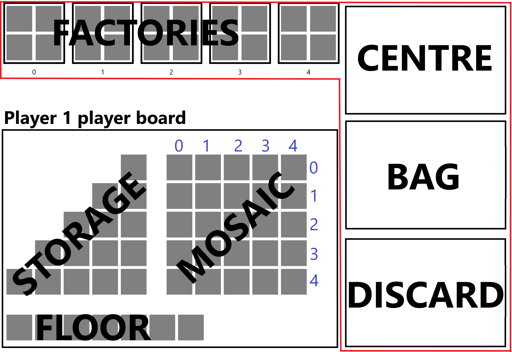

We will be playing a two-player game, but you may extend your game to accommodate up to four players.

### Starting a Round
Each factory is filled with exactly four tiles drawn randomly from the bag.
If at any point you run out of tiles in the bag, you should move all the tiles from the discard pile into the bag and then continue filling the factories.

## Playing the Game

The game is played over multiple rounds, each of which is composed of three phases.
1. Drafting
2. Mosaic-tiling/Scoring
3. Preparing for next round

### 1. Drafting

The starting player places the first player token in the *centre*, then takes the first turn. Play continues clockwise.
On your turn, you must either:
1. Pick all tiles of the same colour from one factory and move the remaining tiles on this factory to the centre.
2. Pick all tiles of the same colour from the centre. If you are the first person to do so, you also take the starting player
   token and place it on your floor. You will be the first player next round.

After picking up tiles, you must add them to **one** of the five *storage rows* on your board, adhering to the following conditions:
1. You must place the tiles **from right to left** in your chosen row.
2. If a row already contains tiles, you may only add tiles of the same colour to it.
3. If you have more tiles than can fit in your chosen row, then you must place the excess tiles on the *floor*.
4. You are not allowed to place tiles of a certain colour in a row if the corresponding mosaic row already contains a tile
   of that colour.
5. If you cannot or do not want to place tiles on a row, you may place them directly onto the *floor*.

In the example images below, the player has picked up two `'a'` tiles. They may place these tiles in one of three ways:

1. place one tile in *row 0*, dropping the other tile onto the *floor*;

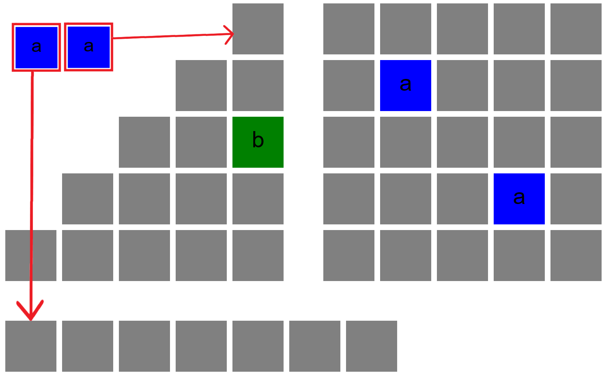 

2. place both tiles into *row 4*; or

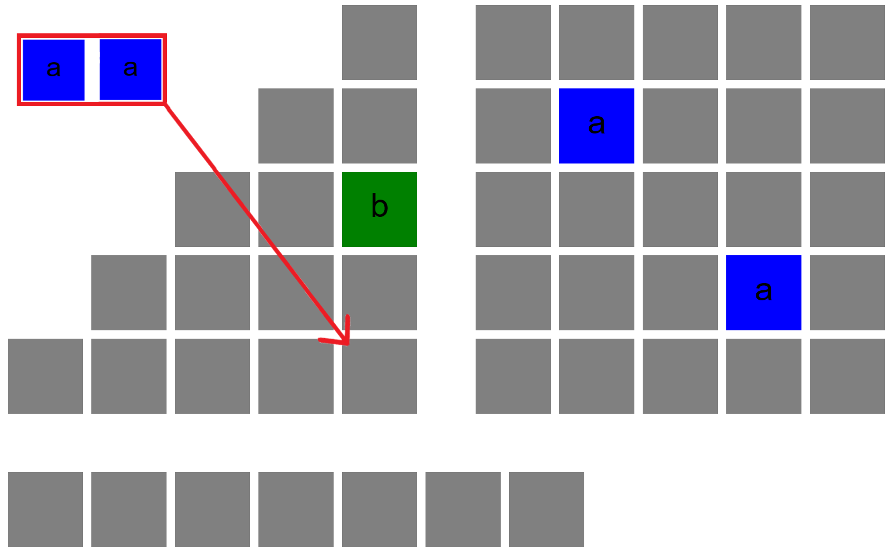

3. place both tiles onto the *floor*.

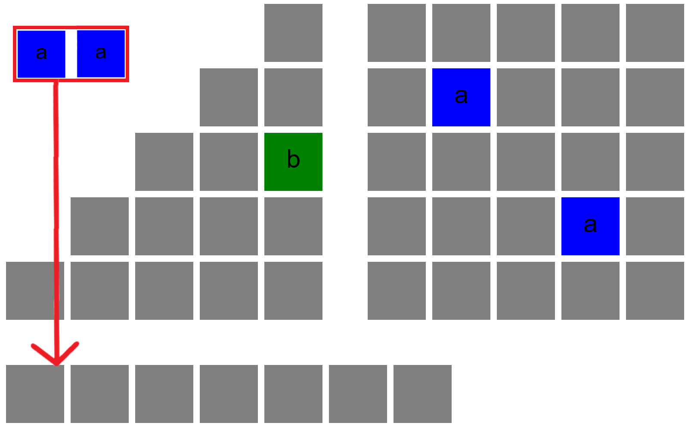

Note that they cannot place the tiles in *row 1* or *row 3* because the corresponding mosaic rows already contain an `'a'` tile.
They also may not place the tiles in *row 2* because a different coloured tile is already stored there.

### Placing tiles on the floor
The floor can hold at most 7 tiles. If you would place more tiles onto the floor, they are placed into the discard pile instead.
If you would place the first player tile (see [encoding game state](https://gitlab.cecs.anu.edu.au/comp1110/dev/comp1110-ass2-dev#encoding-game-state) below) on the floor when the floor is full, you should swap the last tile on the floor with the first player tile, placing the last tile into the discard pile, and the first player tile onto the floor. *The first player tile cannot be placed in the discard pile.*

### 2. Mosaic-tiling/Scoring

The player that made the last drafting move for the round scores their mosaic first. Once they have finished tiling/scoring their mosaic, the next player tiles/scores their mosaic.

**Beginner Mosaic:**
This is a suggested mosaic pattern. It obeys all the rules of the variant mosaic below. Note that the tests will be testing against the variant mosaic, not against the beginner mosaic.
1. Go through your storage rows from row 0 to row 4 and move the **rightmost** tile of each **complete** row to the space
   of the same colour in the corresponding row of the mosaic. The pattern can be seen in the image below.

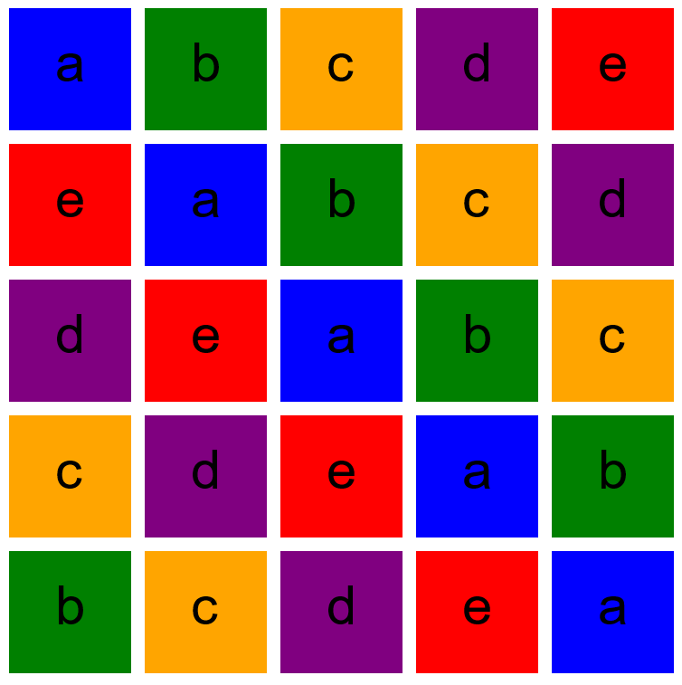 

*Each time you move a tile, score points **immediately***.

2. Empty any row that no longer has a tile in the rightmost space and place all remaining tiles in the discard pile.
   Any tiles that remain in incomplete rows on your board remain for the next round.

In the example below, the rightmost tiles `'e'` `'a'` and `'c'` are in complete rows.
They are moved across into the `mosaic`, starting from row 0.
The remaining `'a'` and `'c'` tiles are placed in the `Discard` pile. The `'b'` and `'d'` tiles do not form a complete row,
so they are left in the storage area for the next round.

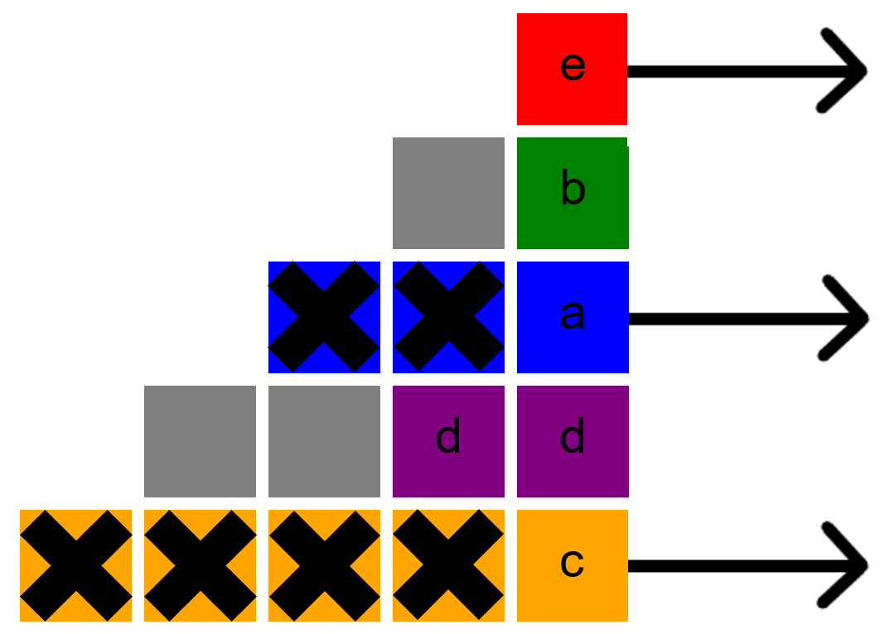
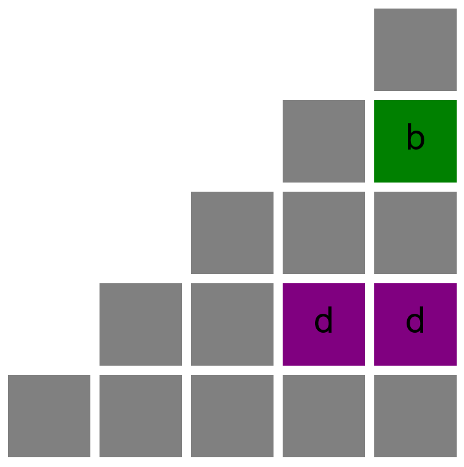

**Variant Mosaic:**
1. Go through your storage rows from row 0 to row 4 and move the **rightmost** tile of each **complete** row to a space
   of your choosing in the corresponding row of the mosaic with the following condition:
- Each row and column of the mosaic may not contain more than one tile of the same colour (much like a sudoku).
- *Each time you move a tile, score points **immediately***.
- If you are unable to move a tile of a certain colour across because there is no valid space
  left for it, you must place **all** tiles from that row onto your floor instead.
2. As with the beginner mosaic, empty any row that no longer has a tile in the rightmost space and place these in the discard pile.
   Any tiles that remain on your board remain for the next round.

In the example below, the player must place an `'a'` tile in row 1 but cannot place it
in columns 1, 3 or 4 because those columns already contain an `'a'` tile.

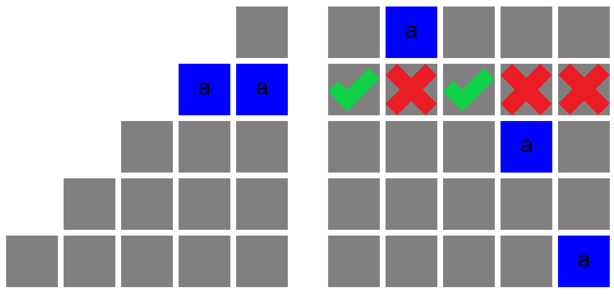

#### Scoring
Each tile is always placed on the mosaic space matching its colour and is immediately scored.
- If there are no tiles **directly** adjacent (vertically or horizontally) to this tile, gain 1 point.

OR if there are adjacent tiles, perform both of the following steps.
- If there are 1 or more **horizontally**-linked tiles, gain 1 point for each horizontally-linked tile, including the tile
  you just placed.
- If there are 1 or more **vertically**-linked tiles, gain 1 point for each vertically-linked tile, including the tile
  you just placed.

In the first example below, the red `'e'` tile is placed in row 2, column 3. There are 3 tiles horizontally linked, so it scores 4 points (one for each
horizontally-linked tile, and 1 for itself). There are also 2 tiles vertically linked, so it scores 1 point for each vertically-linked tile, and 1 for itself.
Yes, the `'e'` tile is counted twice!
Placing this tile gains the player 7 points in total.

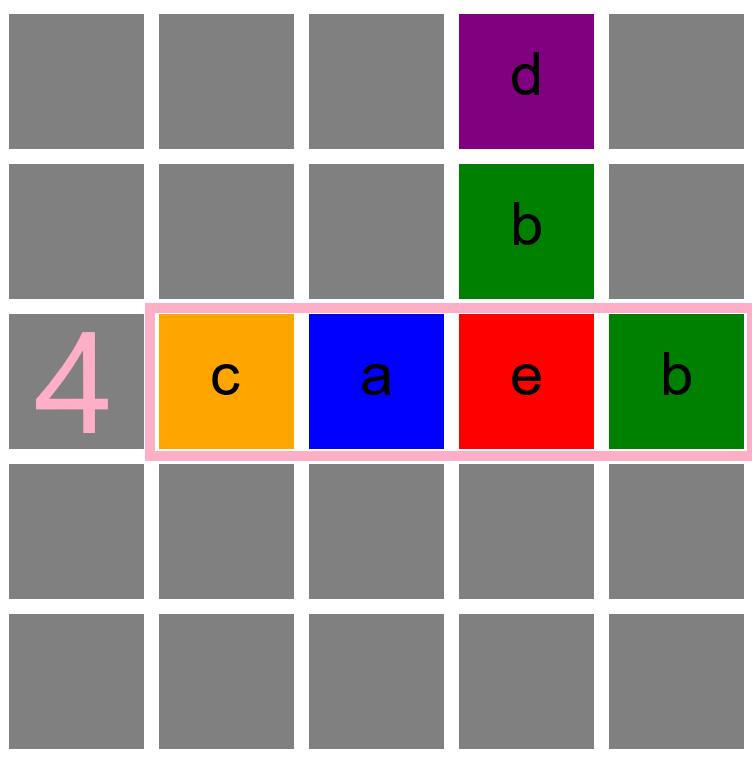 
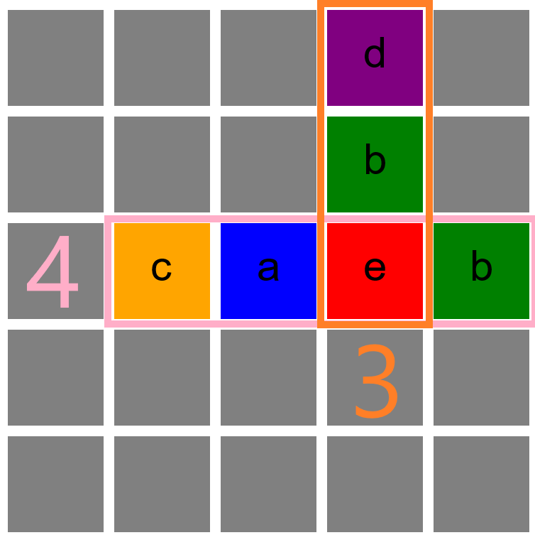 

In the second example below, the red `'e'` tile is again placed in row 2, column 3. Like example 1 it scores 3 points for the vertically-linked tiles,
but it only scores 2 points for the horizontally-linked tiles, because the `'c'` tile in row 2, column 1 is *not* horizontally linked. The player gains a total of 5 points
for this placement.

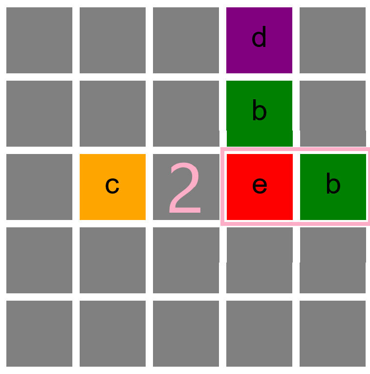 
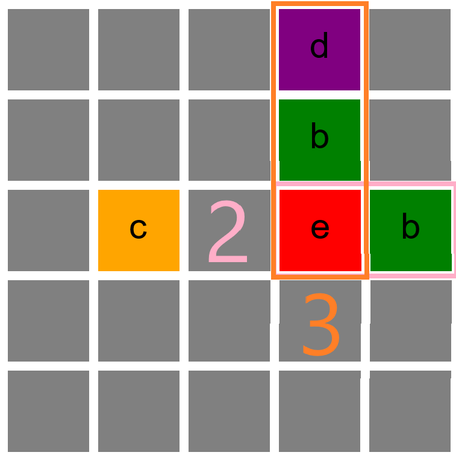 

After you have finished scoring the mosaic, check if you have any tiles on the floor. You lose points based on the number of tiles you have
on the floor. The first player token is considered a normal tile on the floor. Note that you cannot drop below 0 points.

| Number of Tiles | Total Points Lost |
| ------ | ------ |
| 1 | -1 |
| 2 | -2 |
| 3 | -4 |
| 4 | -6 |
| 5 | -8 |
| 6 | -11 | 
| 7+ | -14 |

Following this, add all tiles to the discard pile, except the first player tile which is placed back in the centre.
The player that held the first player tile will take the first turn in the next round.

### 3. Preparing for next round
If someone has completed a row of their mosaic see *End of the Game*, otherwise prepare the next round. Each factory is refilled with 4 tiles from the bag.
If the bag is empty, refill it with the tiles from the discard area and then continue filling the factories. In the rare
case that you run out of tiles again while there are none in the discard, start the next round as usual even though the
factories aren't all filled.

### End of the Game
The game ends when any player completes a *row* of their mosaic. When this happens, players finish the current scoring phase
and then score bonus points. The player with the highest score wins. In the case of a draw, the player with the greatest
number of complete rows wins. In the case of a further draw, those players share the win.

#### Bonus Points
Each player gains additional bonus points if they satisfy the following conditions:

* Gain 2 points for each complete row of your mosaic (5 consecutive horizontal tiles).
* Gain 7 points for each complete column of your mosaic (5 consecutive vertical tiles).
* Gain 10 points for each colour of tile for which you have placed all 5 tiles on your mosaic.

## Encoding Game State

At any time in the game, the current game `state` is encoded as an array of two strings.
`state[0]` is a string representing the state of the factories, bag and discard piles.
`state[1]` is a string representing the state of the players.

#### Tiles
Each tile is represented by a char as follows. You may choose your own tile colours,
so long as the character encoding is consistent.

- Blue  : `'a'`
- Green : `'b'`
- Orange : `'c'`
- Purple : `'d'`
- Red : `'e'`
- First Player : `'f'`

### Shared state - `state[0]`
`state[0]` is a string representing the state of the *Factories*, the tiles left in the *Bag* and the tiles in the
*Discard* pile.
It consists of a single-character first player string, a number of 5-character Factory placement strings, a centre placement string, an 11-character
Bag placement string and an 11-character Discard placement string.

**{Turn}{Factory}{Centre}{Bag}{Discard}**

#### Turn

The Turn string is one character `"A"`-`"D"` representing a player, which indicates that it is this player's turn to make the next drafting move.
(In a two-player game, the player string can only take the values `"A"` or `"B"`).

#### Factories
The Factories placement string begins with an 'F' and is followed by a number of individual factory placement string.
Each encoding of a singular Factory placement string is as follows:

{Factory number}{tiles}

- The first character is a number 0-8 representing the Factory number. Factories are numbered sequentially, so in a 2-player
  game, we will have factories 0 to 4.
- The following 0 - 4 characters are letters `a` to `e` representing the tiles stored there in alphabetical order.
  For example: `"F0abbe2ccdd"` reads "Factory 0 has one `a` tile, two `b` tiles, one `c` tile, one `e` tile, Factory 2
  contains two `c` tiles and two `d` tiles, and Factories 1, 3, and 4 are empty.
  If a factory is empty, it does not appear in the factories string.

#### Centre
The encoding for the Centre placement string is very similar for factories, but is not limited to 4 tiles.
* The first character is a `"C"`.
* The following characters are any number of `a` to `e` tiles and up to one `f` (first player) tile, in alphabetical order.
  for example:
* `"C"` means the Centre is empty.
* `"Caaaabbcf"` means the Centre contains four `a` tiles, two `b` tiles, one `c` tile and one `f` tile.

#### Bag
The Bag is an 11-character string that represents the tiles left in the Bag.
* `1st` character is a `"B"`.
* `2nd`  and `3rd` characters represent the number of `a` tiles in the string.
* `4th`  and `5th` characters represent the number of `b` tiles in the string.
* `6th`  and `7th` characters represent the number of `c` tiles in the string.
* `8th`  and `9th` characters represent the number of `d` tiles in the string.
* `10th` and `11th` characters represent the number of `e` tiles in the string.

#### Discard
The Discard is an 11-character string that represents the tiles in the Discard area.
* first character is a `"D"`.
* The following characters are formulated in the same way as the above Bag string.
* For example, `"D0005101500"` means the Discard contains:
* zero `a` tiles, 5 `b` tiles, ten `c` tiles, fifteen `d` tiles and zero `e` tiles.

#### Entire Shared State String

- A complete shared state string at the start of the game (with full factories and an empty discard area) might look like this: `"AF0cdde1bbbe2abde3cdee4bcceCfB1915161614D0000000000"`
- At the end of the first turn, after emptying all the factories and discarding some tiles, the shared state string might look like this: `"AFCB1915161614D0003010203"`

### Player States - `state[1]`
`state[1]` is a string representing the individual player states.
It consists of up to four player strings, each composed of 5 substrings:

**{Player}{Score}{Mosaic}{Storage}{Floor}**

#### {Player}
The Player String is one character `"A"`-`"D"` representing the player.
(In a two-player game, the player string can only take the values `"A"` or `"B"`).

#### {Score}
The Score is a string of up to three digits representing the player's score.
* For example `"120"` means the player has a score of 120. A score of 0 is represented by `"0"`.

#### {Mosaic}
The Mosaic is a string prefixed by `"M"` and composed of 3-character substrings representing the tiles on the mosaic.
The mosaic is a 5x5 grid indexed by (row, column).
* The first character is `"M"`
* The following characters are in groups of three in the pattern: {tile}{row}{column}
    * tile `a` - `e`.
    * row number `0` - `4`.
    * column number `0` - `4`.

For example `"Mb00a02a13e42"` means there is one `b` tile located at `row 0`, `column 0` `(0,0)` two `a` tiles located at `(0,2)` and `(1,3)`, and one `e` tile located at `(4,2)`. Note that the Mosaic string is ordered by `row` then `column` ie: a01 comes before a10.

An empty mosaic string would look like this: `"M"`

#### {Storage}
The Storage String is composed of 3-character substrings representing the tiles in the storage area. These are ordered
numerically by row number.
* The first character is `"S"`
* The remaining characters are in groups of three in the pattern: {row number}{tile}{number of tiles}
    * row number `0` - `4`.
    * tile `a` - `e`.
    * number of tiles stored in that row from `1` - `5`.
      *Note:* The maximum number of tiles in a given row is equal to *(row number + 1)*.

For example `"S2a13e44a1"` means `row 2` contains one `a` tile, `row 3` contains four `e` tiles and `row 4` contains 1 `a`
tile whilst `row 0` and `row 1` contain no tiles. If a row is empty it does not appear in the storage string.
An empty Storage string would look like: `"S"`.

#### {Floor}
The Floor String is composed of 0 or more tiles sorted alphabetically. Note that you may choose to display the tiles in your
GUI unsorted.
* first character is `"F"`
* the following 0 or more characters are `a` to `f` where `f` represents the first player token. Note that there is only
  one first player token.

For example:
`"Faabbe"` means two `a` tiles, two `b` tiles and one `e` tile have been dropped on the floor.
An empty Floor string would look like this: `"F"`

#### Entire Player State

* A *single* player state string might look like this: `"A20Ma02a13b00e42S2a13e44a1Faabbe"`
* A *full* player state string for 2 players might look like this: `"A20Ma02a13b00e42S2a13e44a1FaabbeB30Mc01b11d21S0e12b2F"`
* An *empty* player state string for 2 players would look like this: `"A0MSFB0MSF"`

### Drafting Move

A drafting move is encoded by a 4-character string that describes the movement of tiles from a factory or the centre to a player's storage area and/or floor.

- first character is 'A' to 'B' and represents the player making the move.
- second character is '0' to '4' or 'C' and represents the factory (0-4) or centre (C) from which the player is picking tiles.
- third character is 'a' to 'e' representing the colour of tile selected.
- fourth character is '0' to '4' or 'F' and represents the row (0-4) or floor (F) where the tiles are to be placed.

For example: "B1aF" means "player B removed all the `a` tiles from factory `1` and placed them on the floor".

### Tiling Move
A tiling move is encoded by a 3-character string that describes the movement of tiles from a player's storage area to their mosaic.

- first character is 'A' to 'B' and represents the player making the move.
- second character is '0' to '4' and represents the row from which a tile is being moved from the storage to the mosaic.
- third character is '0' to '4' or 'F' and represents the column of the mosaic the tile will be placed in, or the floor.

For example: "A03" means "player A moves the rightmost tile from storage row 0 into the mosaic at row 0, column 3".
"A2F" means "player A moves all tiles from storage row 2 into the floor".

## Use Your Creativity!

Software development is fundamentally a creative exercise.   You are building something new.   This is all the more
true when you are creating a game with a GUI.   You are encouraged to be creative in this assignment.
There are some well-defined specifications which you must abide by, but outside of those, there is a great deal of scope for creativity.
Have fun!

## Legal and Ethical Issues

First, as with any work you do, you must abide by the principles of [honesty and integrity](http://academichonesty.anu.edu.au).
We expect you to demonstrate honesty and integrity in everything you do.

In addition to those ground rules, you must follow the rules one would normally be subject to in a commercial setting.
In particular, you may make use of the works of others under two fundamental conditions:
a) your use of their work must be clearly acknowledged, and
b) your use of their work must be legal (for example, consistent with any copyright and licensing that applies to the given material).
*Please understand that violation of these rules is a very serious offence.*
However, as long as you abide by these rules, you are explicitly invited to conduct research and make use of a variety of sources.
You are also given an explicit means with which to declare your use of other sources (via originality statements you must complete).
It is important to realize that you will be assessed on the basis of your original contributions to the project.
While you won't be penalized for correctly attributed use of others' ideas, the work of others will not be considered as part of your contribution.
Therefore, these rules allow you to copy another student's work entirely if:
a) they gave you permission to do so, and
b) you acknowledged that you had done so.
Notice, however, that if you were to do this, you would have no original contribution and so would receive no marks for the assignment (but you would not have broken any rules either).

## Evaluation Criteria

It is essential that you refer to the [deliverables page](https://cs.anu.edu.au/courses/comp1110/assessments/deliverables/) to check that you understand each of the deadlines and what is required.
Your assignment will be marked via tests run through GitLab's continuous integration (CI) framework, so all submittable materials will need to be in your GitLab repository in the *correct* locations, as prescribed by the [deliverables page](https://cs.anu.edu.au/courses/comp1110/assessments/deliverables/).

**The mark breakdown is described on the
[deliverables](https://cs.anu.edu.au/courses/comp1110/assessments/deliverables/) page.**

### Part One

In the first part of the assignment, you will:
* Implement parts of the text interface to the game (Tasks #2, #3, #5, #6, #7, and #8).
* Implement a simple viewer that allows you to visualize game states (Task #4).

An indicative grade level for each task for the [completion of part one](https://cs.anu.edu.au/courses/comp1110/assessments/deliverables/#D2C) is as follows:

**Pass**
* Tasks #2 and #3

**Credit**
* Tasks #4 and #5 *(in addition to all tasks required for Pass)*

**Distinction**
* Task #6, #7 and #8 *(in addition to all tasks required for Credit)*

### Part Two

Using JavaFX, implement a complete playable graphical version of the game in a 1280x768 window.

Notice that aside from the window size, the details of exactly how the game looks etc., are **intentionally** left up to you.
The diagrams above are for illustration purposes only, although you are welcome to use all of the resources provided in this repo, including the bitmap images.

The only **firm** requirements are that:

* you use Java and JavaFX,
* the game respects the specification of the game given here,
* the game be easy to play,
* it runs in a 1280x768 window, and
* that it is executable on the VDI from a JAR file called `game.jar`,

Your game must successfully run from `game.jar` from within another user's (i.e. your tutor's) account on the VDI (in other words, your game must not depend on features not self-contained within that jar file, the Java 15 runtime and the JavaFX library).

An indicative grade level for each task for the [completion of part two](https://cs.anu.edu.au/courses/comp1110/assessments/deliverables/#D2F) is as follows:

**Pass**
* Correctly implements all of the <b>Part One</b> criteria.
* Appropriate use of git (as demonstrated by the history of your repo).
* Completion of Tasks #9, and #10
* Executable on the VDI from a runnable jar file, game.jar, which resides in the root level of your group repo.

**Credit**
* _All of the Pass-level criteria, plus the following..._
* Task #11 and #12

**Distinction**
* _All of the Credit-level criteria, plus the following..._
* Tasks #13 and #14

**High Distinction**
* _All of the Distinction-level criteria, plus the following..._
* Tasks #15 and #16
